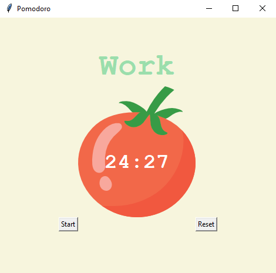

# Pomodoro Timer

Welcome to the Pomodoro Timer! This is a simple timer application based on the Pomodoro Technique, a time management method that uses a timer to break down work into intervals, traditionally 25 minutes in length, separated by short breaks.

## Features
- Timer Mechanism: The timer automatically switches between work sessions and breaks based on the Pomodoro Technique.
- Customizable Intervals: You can customize the duration of work sessions, short breaks, and long breaks.
- Visual Cues: The timer visually indicates the current session (work or break) and displays a countdown timer.
- Progress Tracking: Keeps track of completed work sessions and displays checkmarks for each completed session.
- Reset Option: Allows you to reset the timer and start a new Pomodoro session.

## How to Use
1. Click the "Start" button to start the timer.
2. Work session: Focus on your work during the work session (default: 25 minutes).
3. Breaks: Take short breaks (default: 5 minutes) between work sessions. Every 4 work sessions, take a longer break (default: 20 minutes).
4. Click the "Reset" button to reset the timer and start a new Pomodoro session.

## Installation
1. Clone the repository or download the files.
2. Install the required dependencies (Python, tkinter).
3. Run the `main.py` file using a Python interpreter.

## Screenshots

## Credits
- Developed by [Supun Wickramarachchi](https://github.com/supunwickramarachchi).
- Inspired by the Pomodoro Technique for time management.

Enjoy using the Pomodoro Timer to improve your productivity and time management skills!
